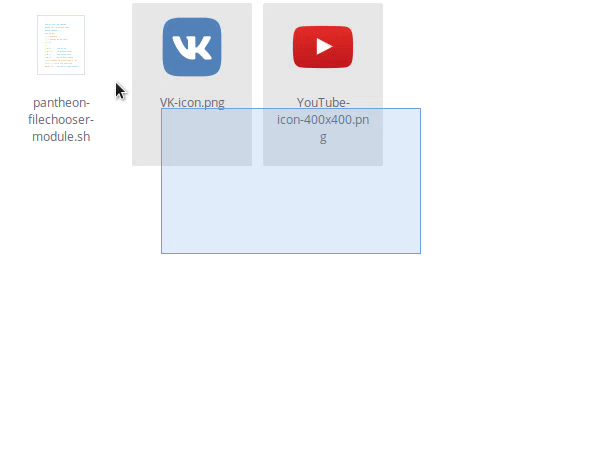

# create-folder-pantheon-files

This script adds the function to create folders from selected objects like in Nautilus in [pantheon-files](https://github.com/elementary/files). 

 

# Install

Run the `INSTALL.sh` as root

```
sudo chmod +x INSTALL.sh
sudo ./INSTALL.sh
```

One-liner:

```
wget https://raw.githubusercontent.com/gechandesu/make-folder-pantheon-files/master/install.sh; sudo chmod +x INSTALL.sh; exec ./INSTALL.sh
```

## Manual installation

Move `make-folder-with.contract` to `~/.local/share/contractor`.

```
mv make-folder-with.contract ~/.local/share/contractor
```

Place `make-folder-with` in some folder and give it execute rights. 

```
chmod +x make-folder-with
```

Uncomment the last string in `make-folder-with.contract` and write the full path to `make-folder-with` script.

Done! 
